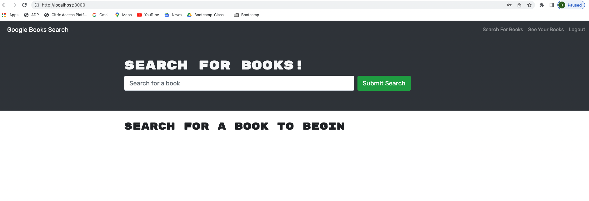

## Description

This application allows the user to search for any books and then save them based on their preference and store them using a secured login.

## Screenshot

## GitHub Repo

Repo: https://github.com/RekhaLeelara/BookSearchEngine

## Application URL

https://booksearchengine1218.herokuapp.com/

## Usage

1. Go to Application link
2. Signup/Login using your valid credentials
3. Search for a book
4. Save book 
5. Click on "See your books" to see the saved books
6. Delete saved books (If needed)
7. Logout of the application

## Support

N/A

## Roadmap

Add graphics to make this presentable and add more contents/skills.

## License

N/A

## Project Status

Baseline project completed. Additional enhancements can be done based on the user feedback.
